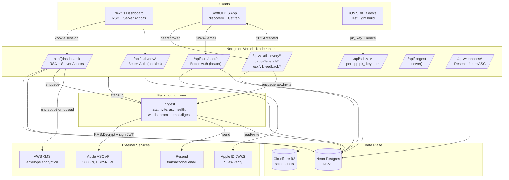
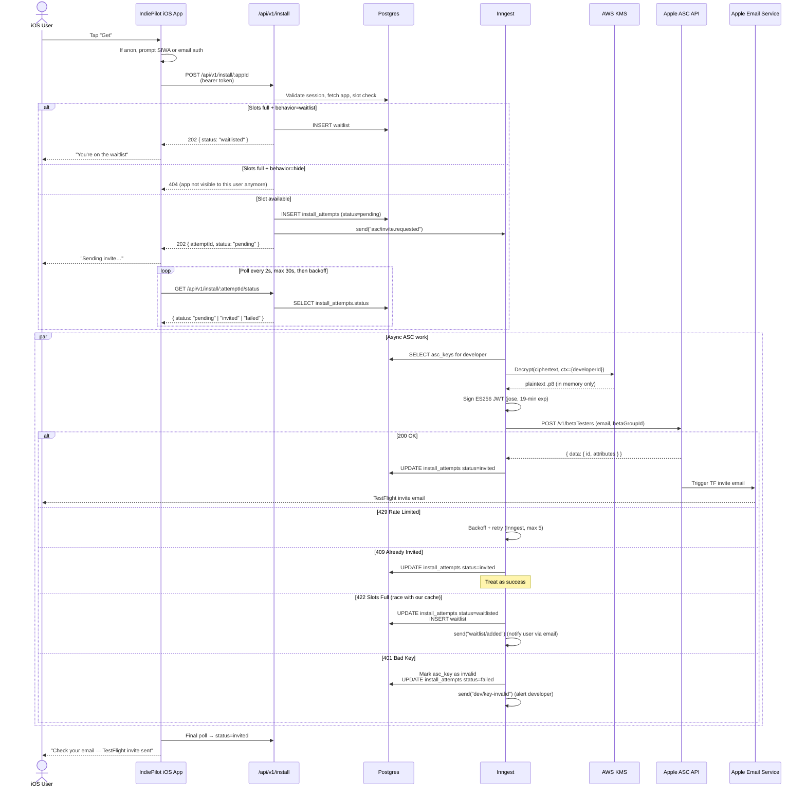
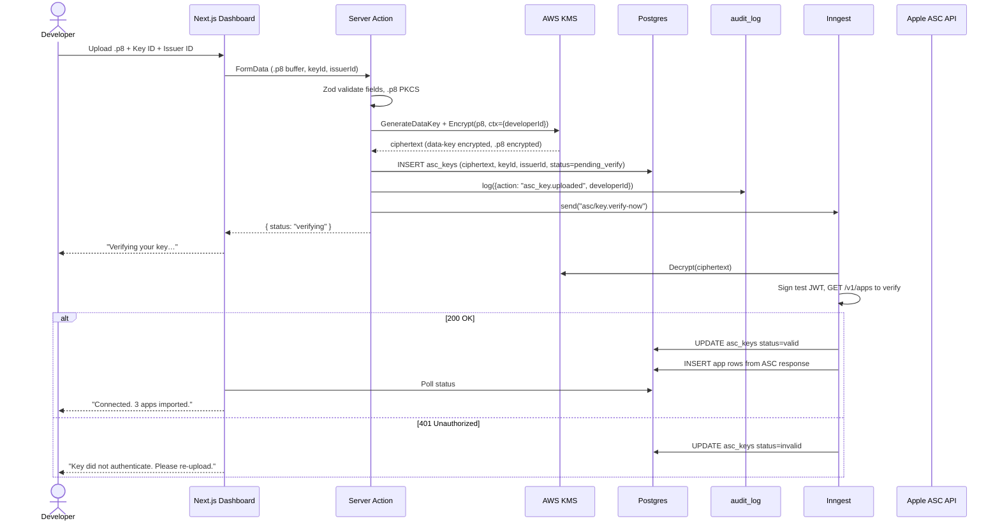
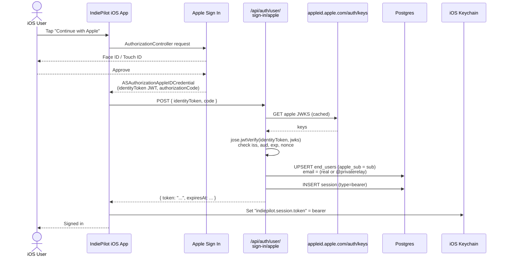
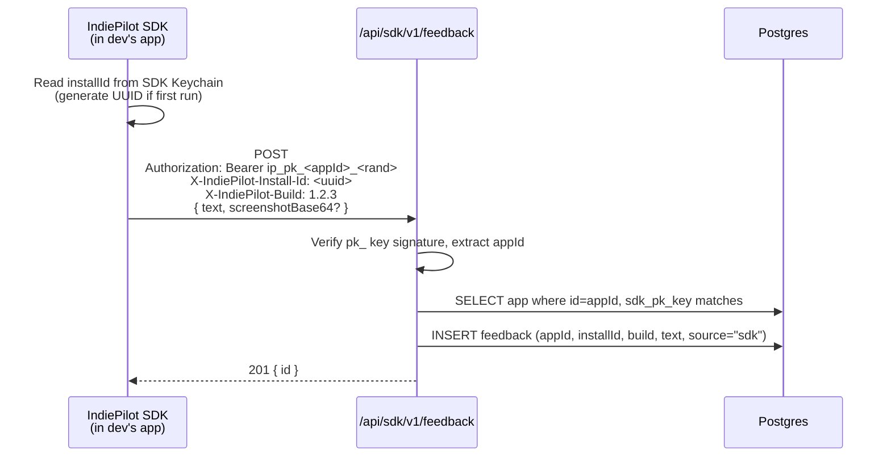

# Architecture Research

**Domain:** Multi-surface TestFlight discovery platform (Next.js web dashboard + SwiftUI iOS app + optional iOS SDK + ASC API broker)
**Researched:** 2026-04-28
**Confidence:** HIGH overall (MEDIUM on a few Better-Auth + Vercel-product specifics, called out inline)

This document builds **on top of** the choices already locked in `STACK.md` (Next.js 15 App Router, Drizzle, Better-Auth, Inngest, AWS KMS, Resend, Cloudflare R2, SwiftUI native iOS, source-distributed iOS SDK). It does **not** re-litigate those choices. It answers: given those parts, how do they fit together, where are the trust boundaries, and in what order are they built?

---

## Standard Architecture

### System Overview

```
┌──────────────────────────────────────────────────────────────────────────────┐
│                              CLIENT SURFACES                                 │
├──────────────────────────────────────────────────────────────────────────────┤
│  ┌─────────────────────────┐ ┌────────────────────────┐ ┌──────────────────┐ │
│  │  Web (Next.js RSC + UI) │ │ SwiftUI iOS User App   │ │ iOS SDK (in-app) │ │
│  │  Developer Dashboard    │ │ Discovery + "Get" tap  │ │ in dev's TF build│ │
│  └────────────┬────────────┘ └────────────┬───────────┘ └────────┬─────────┘ │
│   cookie-auth │                bearer-auth │                  api-key │       │
└───────────────┼─────────────────────────────┼─────────────────────────┼──────┘
                │                             │                         │
                ▼                             ▼                         ▼
┌──────────────────────────────────────────────────────────────────────────────┐
│                       NEXT.JS APP (Vercel, Node runtime)                     │
├──────────────────────────────────────────────────────────────────────────────┤
│  app/(marketing)        Public marketing pages, share links                  │
│  app/(dashboard)        RSC + Server Actions  (dev cookie session)           │
│  app/api/auth/dev/*     Better-Auth instance: developers                     │
│  app/api/auth/user/*    Better-Auth instance: end users (bearer)             │
│  app/api/v1/discovery/* Public read API for iOS app (feed, detail, search)  │
│  app/api/v1/install/*   "Get" tap → enqueues ASC tester-add (returns 202)   │
│  app/api/v1/feedback/*  Feedback + votes from iOS app                       │
│  app/api/sdk/v1/*       Public SDK-only endpoints (per-app pk_ key)         │
│  app/api/inngest        Inngest serve() handler                             │
│  app/api/webhooks/*     Resend bounce/complaint, future ASC webhooks        │
└────────────────────────────────────┬─────────────────────────────────────────┘
                                     │
        ┌────────────────────────────┼─────────────────────────────────┐
        │                            │                                 │
        ▼                            ▼                                 ▼
┌──────────────────┐      ┌──────────────────────┐       ┌────────────────────┐
│ Inngest          │      │ Neon Postgres        │       │ External Services  │
│ (durable jobs)   │      │ (Drizzle, branched   │       │                    │
│                  │      │  per preview)        │       │  AWS KMS           │
│ - asc.invite     │      │                      │       │   - master CMK     │
│ - asc.health     │      │ - developers         │       │   - GenerateDataKey│
│ - waitlist.promo │      │ - end_users          │       │   - Decrypt        │
│ - email.digest   │      │ - asc_keys (cipher)  │       │                    │
│ - stats.rollup   │      │ - apps               │       │  Apple ASC API     │
│                  │      │ - testers (per-app)  │       │   - betaTesters    │
│                  │      │ - waitlist           │       │   - betaGroups     │
│                  │      │ - feedback / votes   │       │                    │
│                  │      │ - install_events     │       │  Apple ID JWKS     │
│                  │      │ - sdk_keys           │       │   (SIWA verify)    │
│                  │      │ - sessions           │       │                    │
│                  │      │ - audit_log          │       │  Resend            │
│                  │      │                      │       │   - send + webhook │
│                  │      │                      │       │                    │
│                  │      │                      │       │  Cloudflare R2     │
│                  │      │                      │       │   (screenshots)    │
└──────────────────┘      └──────────────────────┘       └────────────────────┘
```

### Mermaid: Component Diagram



### Component Responsibilities

| Component | Responsibility | Implementation |
|-----------|----------------|----------------|
| **Next.js Dashboard (RSC)** | Render developer UI, gated by Better-Auth cookie session. Server Actions for forms (publish, edit, key upload, settings). | `app/(dashboard)/*` route group, RSC by default, Server Actions wrapped with `next-safe-action` + Zod. |
| **Public Marketing / Share** | Public app pages (SEO), share links (`/[handle]/[app-slug]`), redirect-friendly so iOS Universal Links work. | `app/(marketing)/*` route group, fully RSC, ISR-cached for app pages. |
| **Auth — Developers** | Email/password + email verification + sessions. Cookie-based (HTTP-only, SameSite=Lax). | Better-Auth instance #1 mounted at `/api/auth/dev/*`. Drizzle adapter, Postgres `dev_*` tables. |
| **Auth — End Users** | Email/password + Sign in with Apple. Bearer token (the iOS app stores it in Keychain). | Better-Auth instance #2 mounted at `/api/auth/user/*`, **with bearer plugin enabled**. SIWA verified server-side via `jose` against Apple JWKS. |
| **Public Discovery API** | Read-only endpoints for the iOS app: feed, detail, search, categories. Optional auth (anon browse OK). | `app/api/v1/discovery/*` Route Handlers, JSON, ETag-cached, schema-versioned. |
| **Public Install API** | The "Get" tap endpoint. Validates user, captures install event, **enqueues** Inngest job, returns 202 with a status token. | `app/api/v1/install/*` Route Handlers. Bearer auth required (one of the two `/api/auth/user/*` flows must have happened first). |
| **Public Feedback API** | Submit feedback, upvote/downvote features, list feedback (per-app). | `app/api/v1/feedback/*`. Bearer auth required. |
| **SDK API** | Endpoints used by the optional in-app SDK in *developer's* TestFlight build. Different auth (per-app `ip_pk_...` key + per-install rotating nonce). | `app/api/sdk/v1/*`. Distinct from the user-facing API to avoid leaking IndiePilot end-user PII into developer apps. |
| **Inngest Functions** | Durable async work: ASC tester add (with retry/backoff), waitlist promotion, key health check, email digests, stats rollup. | `lib/inngest/*.ts` functions, served at `/api/inngest`. Per-developer `concurrency` to isolate rate-limit blast radius. |
| **ASC Broker (lib)** | Encapsulates: KMS Decrypt → in-memory `.p8` → ES256 JWT (jose) → ASC HTTP call → Zod-validate response → audit log. **Only ever called from Inngest functions.** | `lib/asc/*.ts`. Not directly importable from Route Handlers (lint rule enforced). |
| **KMS Crypto (lib)** | Envelope-encrypt/decrypt `.p8` blobs using `@aws-crypto/client-node` with `encryptionContext: { developerId, appId? }`. | `lib/crypto/*.ts`. Vercel function authenticates to AWS via OIDC federation (no static AWS keys). |
| **Webhook Handlers** | Resend bounce/complaint → mark email as undeliverable. Future ASC webhooks if Apple ever ships them. | `app/api/webhooks/*`. HMAC-verified. |
| **Postgres (Neon)** | Source of truth for everything except screenshots. Drizzle schema, migrations checked in. | Neon HTTP driver in Route Handlers; Pool/WS driver in Inngest functions where transactions span multiple ops. |
| **R2** | Screenshot storage, served via Cloudflare CDN. | S3-compatible API; uploads gated through a Route Handler that also runs `sharp` for EXIF strip + resize. |
| **iOS App (SwiftUI)** | Discovery UI, Get-tap UX with status polling, Keychain-backed bearer session, SIWA flow. | One Xcode project, iOS 17+ deployment target, `URLSession` + `Codable` + `@Observable`. |
| **iOS SDK** | Drop-in feedback button + view, configured by indie dev with `ip_pk_...` key. Zero deps. Talks **only** to `/api/sdk/v1/*`. | Separate repo `indiepilot-ios-sdk`, source SPM, `swift-tools-version: 6.0`. |

---

## Recommended Project Structure

### Web Monorepo

```
indiepilot/
├── apps/
│   └── web/                              # Next.js 15 app
│       ├── app/
│       │   ├── (marketing)/              # Public, ISR-cached
│       │   │   ├── page.tsx              # Homepage
│       │   │   ├── [handle]/             # Dev profile pages
│       │   │   │   └── [appSlug]/        # Per-app share landing
│       │   │   └── legal/                # ToS, Privacy
│       │   ├── (dashboard)/              # Auth-gated, RSC
│       │   │   ├── layout.tsx            # Calls auth(); redirects if no session
│       │   │   ├── apps/                 # App list, edit, publish
│       │   │   │   └── [appId]/
│       │   │   │       ├── feedback/
│       │   │   │       ├── voting/
│       │   │   │       ├── testers/
│       │   │   │       └── settings/
│       │   │   ├── keys/                 # ASC key upload + rotate UI
│       │   │   └── settings/
│       │   ├── api/
│       │   │   ├── auth/
│       │   │   │   ├── dev/[...all]/     # Better-Auth dev instance
│       │   │   │   └── user/[...all]/    # Better-Auth user instance (bearer)
│       │   │   ├── v1/
│       │   │   │   ├── discovery/        # Feed, detail, search
│       │   │   │   ├── install/          # "Get" tap, status
│       │   │   │   └── feedback/         # Submit, vote, list
│       │   │   ├── sdk/
│       │   │   │   └── v1/               # SDK endpoints (pk_ auth)
│       │   │   ├── inngest/route.ts      # Inngest serve()
│       │   │   └── webhooks/
│       │   │       └── resend/
│       │   ├── emails/                   # React Email templates
│       │   └── globals.css
│       ├── components/                   # shadcn/ui + app-specific
│       ├── lib/
│       │   ├── auth/
│       │   │   ├── dev.ts                # Better-Auth dev config
│       │   │   ├── user.ts               # Better-Auth user config (bearer)
│       │   │   └── siwa.ts               # SIWA token verify (jose + JWKS)
│       │   ├── asc/
│       │   │   ├── jwt.ts                # Sign ES256 JWT (jose)
│       │   │   ├── client.ts             # ASC HTTP client + Zod schemas
│       │   │   ├── tester.ts             # add-tester / lookup-tester
│       │   │   └── errors.ts             # Mapped Apple errors → typed errors
│       │   ├── crypto/
│       │   │   ├── kms.ts                # Envelope encrypt/decrypt
│       │   │   └── sdk-keys.ts           # ip_pk_ generation + verify
│       │   ├── db/
│       │   │   ├── schema/               # Drizzle schemas, one file per domain
│       │   │   ├── client.ts             # neon-http for short-lived
│       │   │   └── pool.ts               # neon-serverless Pool for Inngest
│       │   ├── inngest/
│       │   │   ├── client.ts             # new Inngest({ id: "indiepilot" })
│       │   │   └── functions/
│       │   │       ├── asc.invite.ts     # The critical-path job
│       │   │       ├── asc.health.ts     # Weekly key health check
│       │   │       ├── waitlist.promo.ts
│       │   │       ├── email.digest.ts
│       │   │       └── stats.rollup.ts
│       │   ├── email/
│       │   │   └── send.ts               # Resend client + render helper
│       │   ├── storage/
│       │   │   └── r2.ts                 # Upload, EXIF strip, resize
│       │   ├── audit/
│       │   │   └── log.ts                # audit_log writer
│       │   └── safe-action.ts            # next-safe-action factory
│       ├── drizzle/                      # Generated SQL migrations
│       ├── public/
│       └── package.json
├── packages/
│   └── shared-schemas/                   # Zod schemas shared between web + iOS code-gen
└── package.json                          # pnpm workspace root
```

### iOS App (separate repo, `indiepilot-ios`)

```
indiepilot-ios/
├── IndiePilot.xcodeproj
├── IndiePilot/
│   ├── App/                              # @main, Scene, root nav
│   ├── Discovery/                        # Feed, detail, search views
│   ├── Install/                          # Get-tap flow + status polling
│   ├── Feedback/                         # Submit feedback, voting
│   ├── Auth/
│   │   ├── SignInWithAppleCoordinator.swift
│   │   ├── EmailAuthView.swift
│   │   └── KeychainSession.swift         # Stores bearer token
│   ├── Networking/
│   │   ├── APIClient.swift               # actor, URLSession
│   │   └── Endpoints/                    # one file per resource
│   ├── Models/                           # Codable structs matching shared-schemas
│   └── DesignSystem/
└── IndiePilotTests/
```

### iOS SDK (separate repo, `indiepilot-ios-sdk`)

```
indiepilot-ios-sdk/
├── Package.swift                         # swift-tools-version: 6.0, no deps
├── Sources/
│   └── IndiePilot/
│       ├── IndiePilot.swift              # configure(), entry point
│       ├── FeedbackButton.swift          # SwiftUI view
│       ├── FeedbackView.swift            # SwiftUI view
│       ├── Voting.swift                  # SwiftUI view
│       ├── Networking/
│       │   ├── SDKClient.swift           # URLSession, signs requests with pk_ key
│       │   └── DeviceID.swift            # Stable anonymous ID (Keychain), NOT IDFV
│       └── PrivacyInfo.xcprivacy
├── Tests/IndiePilotTests/
└── README.md
```

### Structure Rationale

- **Two Better-Auth instances under separate URL prefixes** — devs and end-users have different signup, password requirements, and (eventually) tier features. One instance per role keeps tables and middleware clean. Cookie auth for devs (web), bearer auth for end-users (native iOS) per Better-Auth's bearer plugin.
- **`/api/v1/*` for the iOS app, `/api/sdk/v1/*` for the SDK** — different auth, different rate limits, and different audiences. Versioned because mobile clients don't update synchronously.
- **`lib/asc/*` only callable from Inngest** — enforced by a Biome custom rule or a simple grep in CI. Prevents the most likely production incident: someone calling ASC inside a Route Handler "just for one quick endpoint" and blowing the rate limit.
- **`lib/inngest/functions/` named by domain** — `asc.invite`, `asc.health`, etc. Mirrors the event names used to trigger them. Easy to find when an event fails.
- **iOS app and SDK are separate repos** — the SDK is a public API contract for third-party devs. Putting it in the same repo as the consumer app encourages accidental coupling and makes versioning awkward.
- **Drizzle schema split by domain file** (`schema/auth.ts`, `schema/asc.ts`, `schema/feedback.ts`) — easier to navigate than one giant file once the project grows.

---

## Architectural Patterns

### Pattern 1: Synchronous "Get" Submit, Asynchronous Tester Add

**What:** When a user taps "Get", the iOS app POSTs to `/api/v1/install/:appId`. The handler does the *fast* work synchronously (validate, dedupe, write `install_attempt` row, enqueue Inngest event) and returns `202 Accepted` with a status token. Inngest does the *slow* work (KMS Decrypt, sign JWT, call ASC, handle 429 retries) asynchronously. The iOS app polls or subscribes to a status endpoint.

**When to use:** Any external API with rate limits, latency variance, or partial-failure modes — i.e. ASC, exactly. Apple's API can take 200ms or 8s; you can't tie a user-facing request to that.

**Trade-offs:**
- **Pro:** UI feels instant. Retries don't time out the user. Inngest gives you durable retry + dashboard visibility for free.
- **Pro:** ASC throttling on developer A doesn't affect user B's experience on developer C's app.
- **Con:** UI complexity — must implement a status state machine. The "Sending invite…" / "Check your email" flow is 4–5 states, not 2.

**Example (Route Handler — fast path):**

```typescript
// app/api/v1/install/[appId]/route.ts
export async function POST(req: Request, ctx: { params: { appId: string } }) {
  const session = await getUserSession(req);
  if (!session) return Response.json({ error: "auth_required" }, { status: 401 });

  const body = await req.json();
  const parsed = InstallRequestSchema.parse(body); // Zod

  const app = await db.query.apps.findFirst({ where: eq(apps.id, ctx.params.appId) });
  if (!app || !app.isPublished) return Response.json({ error: "not_found" }, { status: 404 });

  // Slot check (cached counter — auth source is ASC, but we keep a local mirror)
  if (app.slotsUsed >= app.slotsCap) {
    if (app.fullBehavior === "hide") return Response.json({ error: "not_found" }, { status: 404 });
    // waitlist
    const wl = await db.insert(waitlist).values({ appId: app.id, userId: session.userId, email: session.email }).returning();
    return Response.json({ status: "waitlisted", waitlistId: wl[0].id }, { status: 202 });
  }

  // Idempotency: if this user already has an open attempt for this app, return its status
  const existing = await db.query.installAttempts.findFirst({
    where: and(eq(installAttempts.appId, app.id), eq(installAttempts.userId, session.userId)),
  });
  if (existing) return Response.json({ status: existing.status, attemptId: existing.id }, { status: 202 });

  const attempt = await db.insert(installAttempts).values({
    appId: app.id, userId: session.userId, email: session.email, status: "pending",
  }).returning();

  // Enqueue, do not await ASC
  await inngest.send({
    name: "asc/invite.requested",
    data: { attemptId: attempt[0].id, appId: app.id, developerId: app.developerId, email: session.email },
  });

  return Response.json({ status: "pending", attemptId: attempt[0].id }, { status: 202 });
}
```

**Example (Inngest function — slow path):**

```typescript
// lib/inngest/functions/asc.invite.ts
export const ascInvite = inngest.createFunction(
  {
    id: "asc-invite",
    // Per-developer concurrency: dev A throttling does not block dev B
    concurrency: { limit: 5, key: "event.data.developerId" },
    // Apple's hourly bucket is 3600/hr; throttle well under per-min observed limit
    throttle: { limit: 200, period: "1m", key: "event.data.developerId" },
    retries: 5,
  },
  { event: "asc/invite.requested" },
  async ({ event, step }) => {
    const { attemptId, appId, developerId, email } = event.data;

    // step.run = checkpointed; if a later step fails, this isn't re-run
    const ascContext = await step.run("load-and-decrypt-key", async () => {
      const key = await db.query.ascKeys.findFirst({ where: eq(ascKeys.developerId, developerId) });
      if (!key) throw new NonRetriableError("no_key");
      const p8 = await kmsDecrypt(key.ciphertext, { developerId });
      try {
        const jwt = await signAscJwt(p8, key.keyId, key.issuerId); // ES256, 19-min exp
        return { jwt, betaGroupId: (await db.query.apps.findFirst({ where: eq(apps.id, appId) }))!.ascBetaGroupId };
      } finally {
        // Drop reference; node will GC. We do not write p8 to disk anywhere.
      }
    });

    const ascResult = await step.run("call-asc", async () => {
      try {
        return await ascAddTesterToBetaGroup({
          jwt: ascContext.jwt, betaGroupId: ascContext.betaGroupId, email,
        });
      } catch (e) {
        if (e instanceof AscRateLimitError) {
          // Inngest retries with backoff; surface the wait via attempt row
          throw e; // retriable
        }
        if (e instanceof AscAlreadyInvitedError) {
          return { ok: true, alreadyInvited: true };
        }
        if (e instanceof AscSlotsFullError) {
          throw new NonRetriableError("slots_full"); // promotes to waitlist via failure handler below
        }
        throw e;
      }
    });

    await step.run("update-attempt", () =>
      db.update(installAttempts)
        .set({ status: "invited", invitedAt: new Date() })
        .where(eq(installAttempts.id, attemptId)),
    );

    await step.run("audit", () =>
      writeAuditLog({ action: "asc.invite", developerId, appId, attemptId, result: "ok" }),
    );
  },
);
```

### Pattern 2: KMS Envelope Encryption with Per-Record Data Keys

**What:** The `.p8` private key is encrypted at rest using AWS KMS envelope encryption via `@aws-crypto/client-node`. The KMS master key never leaves AWS. A unique data key is generated per developer record. The plaintext `.p8` exists in Node memory only during a single ASC JWT signing operation, then is dropped.

**When to use:** Any time you store third-party credentials whose compromise would harm a customer's other systems. ASC `.p8` keys qualify — leak gives an attacker the App Store account.

**Trade-offs:**
- **Pro:** Master key is auditable (CloudTrail). Per-record data keys mean a single SQL leak does not expose plaintext. `encryptionContext` binds ciphertext to `(developerId, appId)` — a row swap fails to decrypt.
- **Pro:** Vercel functions authenticate to AWS via OIDC federation — no static AWS keys in env vars.
- **Con:** Cold-start KMS Decrypt adds ~40–100ms per ASC call. Mitigated by caching the *decrypted JWT* (not the .p8) for 15 minutes per developer per Vercel instance. **Never cache the plaintext `.p8`.**
- **Con:** Adds an AWS account dependency to a Vercel-only project. Worth it for the security posture.

**Example:**

```typescript
// lib/crypto/kms.ts
import { buildClient, CommitmentPolicy, KmsKeyringNode } from "@aws-crypto/client-node";

const { encrypt, decrypt } = buildClient(CommitmentPolicy.REQUIRE_ENCRYPT_REQUIRE_DECRYPT);
const keyring = new KmsKeyringNode({ generatorKeyId: process.env.KMS_KEY_ARN! });

export async function kmsEncrypt(plaintext: Buffer, ctx: { developerId: string }): Promise<Buffer> {
  const { result } = await encrypt(keyring, plaintext, { encryptionContext: ctx });
  return result;
}

export async function kmsDecrypt(ciphertext: Buffer, ctx: { developerId: string }): Promise<Buffer> {
  const { plaintext, messageHeader } = await decrypt(keyring, ciphertext);
  // Verify encryptionContext matches what we expect — defense in depth
  if (messageHeader.encryptionContext.developerId !== ctx.developerId) {
    throw new Error("encryption_context_mismatch");
  }
  return plaintext;
}
```

### Pattern 3: Two-Instance Better-Auth (Devs vs End Users)

**What:** Two Better-Auth instances mounted at different URL prefixes, with different storage tables, session strategies, and feature plugins.

| Surface | Instance | Mount | Session | Why |
|---------|----------|-------|---------|-----|
| Web dashboard | Dev instance | `/api/auth/dev/*` | HTTP-only cookie, 7-day rolling | Browser; CSRF protection via SameSite=Lax |
| iOS user app | User instance + bearer plugin | `/api/auth/user/*` | Bearer token, stored in Keychain | Native client; no cookie jar |

**When to use:** Whenever two distinct user populations have different lifecycle, auth methods, or commercial models. IndiePilot's devs and end-users diverge on every axis (devs pay eventually; users never; devs never use SIWA; users do).

**Trade-offs:**
- **Pro:** Tables don't get tangled. `developers.id` and `end_users.id` are different namespaces — explicit at every layer.
- **Pro:** Different rate-limit policies, different verification email templates, different fields without if/else everywhere.
- **Con:** Two configs to maintain. If a future feature (e.g., a dev who is also a user) crosses populations, you build a manual link table — that's still better than a `userType` field warring with the auth library.
- **Confidence:** MEDIUM on "two instances" being clean — Better-Auth supports it but it's not the most-trodden path. Verify at scaffold time. Fallback if it bites: one instance with a `role` field and feature-flagged plugins.

### Pattern 4: SDK API Surface — Per-App Public Key + Per-Install Anonymous ID

**What:** The optional iOS SDK sends requests to `/api/sdk/v1/*` with two pieces of identity:
1. **`Authorization: Bearer ip_pk_<appId>_<random>`** — a *public* key tied to one published app. Issued from the dev dashboard. Verifiable server-side because `appId` is in the key. Rotatable without breaking the SDK (old key remains valid until the dev clicks rotate).
2. **`X-IndiePilot-Install-Id: <opaque uuid>`** — an installation-scoped anonymous ID generated on first SDK boot, stored in the SDK's own Keychain item, never tied to the user's IndiePilot account.

The SDK never touches the IndiePilot end-user session token. It cannot. The `pk_` key has no permission to read end-user data, and there is no per-user authentication path in `/api/sdk/v1/*`.

**When to use:** Any third-party SDK shipped inside someone else's app. Hard separation prevents PII leakage between IndiePilot's user data and the developer's app data.

**Trade-offs:**
- **Pro:** The IndiePilot dashboard can show "this feedback came from build 1.2.3 on this anonymous device" without ever exposing who that user is in the IndiePilot app, and without giving the developer any IndiePilot user PII.
- **Pro:** The `pk_` key is *only* able to write feedback/votes for *its* `appId`. Compromise affects one app, not all apps.
- **Con:** Feedback from the SDK and feedback from the IndiePilot iOS app are not linkable to a single user view-of-feedback. Acceptable — the SDK's feedback is contributed inside the developer's app, the iOS app's feedback is contributed inside IndiePilot. Different acts.
- **Anti-feature explicitly excluded:** The SDK MUST NOT send `IDFA`, `IDFV`, location, or any device fingerprint. Only the SDK-generated `installId` (random UUID), build version, OS version, locale.

**Example (SDK request):**

```swift
// Inside indiepilot-ios-sdk
internal func submitFeedback(text: String, screenshot: Data?) async throws {
    var req = URLRequest(url: baseURL.appendingPathComponent("/api/sdk/v1/feedback"))
    req.httpMethod = "POST"
    req.setValue("Bearer \(apiKey)", forHTTPHeaderField: "Authorization")
    req.setValue(installId, forHTTPHeaderField: "X-IndiePilot-Install-Id")
    req.setValue(buildVersion, forHTTPHeaderField: "X-IndiePilot-Build")
    req.httpBody = try JSONEncoder().encode(FeedbackPayload(text: text, screenshotBase64: screenshot?.base64EncodedString()))
    let (_, resp) = try await URLSession.shared.data(for: req)
    // ...
}
```

### Pattern 5: Funnel Events — Three Sources, One Table

**What:** The funnel ("views → Get taps → invites sent → invites accepted → installs") has events from **three** different sources. They write to a single `install_events` table with a `source` column for accurate attribution.

| Funnel step | Source | Mechanism | Confidence |
|-------------|--------|-----------|------------|
| Page views | iOS app + web share-link | Telemetry POST from iOS app on detail-page-shown; web share-link page server-logs the impression | HIGH |
| Get taps | iOS app | The `/api/v1/install/*` POST itself **is** the event | HIGH |
| Invite sent | Inngest `asc.invite` job | Logged when ASC POST returns 200 | HIGH |
| Invite accepted | **Inferred + optional SDK** | Apple does **not** webhook us when a tester accepts. Two signals: (a) ASC API `betaTesters` polled weekly returns `state: "INVITED" → "INSTALLED"`; (b) **if** the dev installs the SDK, the SDK reports `firstLaunch` events tied to anonymous installId, which we can *probabilistically* link via timing window. Surface as "estimated" until the SDK is installed. | MEDIUM (without SDK), HIGH (with SDK) |
| Install / first-launch | iOS SDK only | Only available if the dev integrates the SDK. Call this out in the dashboard: "Install SDK to track this step." | HIGH (with SDK) |

**Trade-offs:**
- **Pro:** Honest about what's measured vs estimated. Devs trust a dashboard that says "estimated, install SDK for exact" more than one that lies with a number.
- **Pro:** Each step's confidence is recorded, so analytics can downgrade summaries appropriately ("3 estimated installs" vs "3 confirmed installs").
- **Con:** Two-step conversion math (sent → accepted) is fuzzier than a typical SaaS funnel. Acceptable.

**Anti-pattern explicitly avoided:** Do not tell devs that "ASC API webhooks tester acceptance" — Apple does not, and pretending otherwise erodes trust within a week. Apple's `betaTesters` resource has a `state` field you can poll; that's the closest signal without the SDK.

### Pattern 6: Idempotency Everywhere on the Critical Path

**What:** Every external-side-effect-causing endpoint in the install flow has an idempotency key derived from `(userId, appId, day)` so that double-taps, network retries, and Inngest re-runs do not create duplicate testers in ASC or duplicate emails.

**When to use:** Any operation whose side effect is observable to a third party (Apple sending a TF email; Resend sending a waitlist promo email).

**Example:** `install_attempts` table has `UNIQUE (user_id, app_id)` until status becomes `failed_terminal` (then a new row is allowed). The Inngest event includes the `attemptId`; `step.run("call-asc", ...)` is checkpointed by Inngest and won't re-run after success even on function replay.

---

## Data Flow

### Critical Path: User taps "Get" → invite arrives

This is THE flow. Everything else is supporting infrastructure.



#### Edge cases that this flow handles

1. **User double-taps Get** → second POST hits the `(user_id, app_id)` unique constraint, returns the existing `attemptId` and current status. No duplicate ASC call.
2. **iOS app loses network mid-poll** → on resume, polls `/status` and picks up where it left off. The Inngest job is durable and will have completed regardless.
3. **Developer's key is revoked between upload and tap** → Inngest job 401s, marks `asc_keys.status = "invalid"`, sets attempt to `failed`, fires `dev/key-invalid` email to dev. The iOS app shows "Couldn't send invite — developer notified" (vague intentionally; do not blame user).
4. **User signed in with SIWA Hide-My-Email** → email is `xxx@privaterelay.appleid.com`. ASC accepts that as a valid email; Apple sends the TF invite to that relay; Apple forwards it to the user's real inbox. Validated end-to-end by the SDK research.
5. **User taps Get on App A, then App B** → two attempts, two Inngest events, two ASC calls. Per-developer concurrency = 5; per-developer throttle = 200/min, so both proceed unless throttled.
6. **Apple has slots-full state we didn't know about** (race between our cached counter and ASC's truth) → `asc.invite` step returns `AscSlotsFullError`, we INSERT into waitlist, fire waitlist email if devs have that on, surface as "you're on the waitlist" via a state push (the iOS app's poll picks up the new status).
7. **Inngest function dies mid-run after KMS Decrypt** → `step.run("call-asc")` had not checkpointed yet; replays. KMS Decrypt is re-run, JWT re-signed, ASC re-called. ASC returns 409 Already Invited (because the prior call did succeed), which we treat as success. **Idempotency saves us.**
8. **Resend bounce on waitlist promotion email** → bounce webhook marks `end_users.email_status = "bounced"`. Future emails are skipped. Surface in dashboard.

### Path: Developer uploads `.p8` key



#### Key handling rules (encoded in code, not just docs)

- The `.p8` Buffer is read from `FormData` directly. **Never** written to disk. **Never** logged. **Never** placed in `console.log`. Pino logger has a redaction allowlist; `.p8`, `jwt`, `dataKey`, `plaintext` are never in it.
- KMS `encryptionContext: { developerId }` is checked on Decrypt. Mismatch throws — catches a row-swap attack.
- AWS authentication is via Vercel → AWS OIDC federation. **No static AWS access keys in env vars.** `AWS_ROLE_ARN` and `AWS_REGION` only.
- Master key rotation is automatic via AWS KMS. Per-record data keys are baked into the ciphertext header by `@aws-crypto/client-node`; no rotation needed.
- Key revocation: Dev clicks "Rotate" → mark current row `status=revoked`, encourage re-upload. UI also points dev to ASC to revoke the key on Apple's side. (We can't revoke their ASC key for them — only Apple can.)

### Path: iOS user signs in (Sign in with Apple)



Subsequent requests carry `Authorization: Bearer <token>`. The Better-Auth bearer plugin validates against the sessions table on each request. Tokens are 7-day rolling; the iOS app silently refreshes by issuing any authenticated request — Better-Auth slides the expiry on activity.

If the Keychain is wiped (factory reset, app reinstall), the user re-authenticates. Tokens never sync via iCloud Keychain — set the `kSecAttrSynchronizable` flag to `false`.

### Path: SDK posts feedback



The `pk_` key authentication is *not* OAuth, *not* a session — it is a public-key-derived API key whose signature the server validates statelessly. The key is "public" only in the sense that it ships in the dev's app binary (anyone could extract it). Its only authority is "submit feedback for app X" — there's no read scope, no other-app scope, no PII scope.

---

## Trust & Security Boundaries

### Boundary 1: Browser ↔ Next.js (developer dashboard)

| Property | Value |
|----------|-------|
| Auth | Better-Auth cookie session, HTTP-only, SameSite=Lax, Secure |
| CSRF | Better-Auth's built-in CSRF on state-changing routes |
| Trusted to provide | Form fields validated by Zod via `next-safe-action` |
| Never trusted to provide | `developerId`, role, billing tier — always re-derived server-side from session |

### Boundary 2: iOS App ↔ Next.js (end users)

| Property | Value |
|----------|-------|
| Auth | Better-Auth bearer token, stored in iOS Keychain (no iCloud sync) |
| Transport | TLS 1.3, HTTP/2 |
| Trusted to provide | Bearer token, request body |
| Never trusted to provide | `userId`, email — re-derived from token; `appId` validated against published apps |

### Boundary 3: SDK ↔ Next.js (third-party app)

| Property | Value |
|----------|-------|
| Auth | `ip_pk_<appId>_<rand>` per-app public key + `X-IndiePilot-Install-Id` |
| Trusted to provide | Anonymous `installId`, build version, OS version, feedback text |
| Never trusted to provide | User identity, IDFV, IDFA, location, anything that ties to a real person |
| Not authorized to | Read other apps' data; read end-user accounts; modify dashboard state |

### Boundary 4: Vercel Functions ↔ AWS KMS

| Property | Value |
|----------|-------|
| Auth | OIDC federation (Vercel issues OIDC token; AWS exchanges for STS credentials) |
| No static keys | `AWS_ACCESS_KEY_ID` not used. Only `AWS_ROLE_ARN`, `AWS_REGION` in env. |
| Permissions | `kms:Encrypt`, `kms:Decrypt`, `kms:GenerateDataKey` on the IndiePilot CMK only |
| Audit | All Decrypt calls log to CloudTrail; we also write `audit_log` row in our DB |

### Boundary 5: Inngest ↔ Apple ASC API

| Property | Value |
|----------|-------|
| Auth | ES256 JWT signed per-developer-per-15-min, in-memory only |
| Plaintext key lifetime | One Inngest function execution; dropped before function returns |
| Rate budget | Per-developer Inngest concurrency=5, throttle=200/min (well under Apple's 300/min observed cap) |
| Failure modes | 401 invalidates key; 429 backs off; 409 Already Invited treated as success; 422 slots-full triggers waitlist |

### Boundary 6: PII Boundary Between End-User Surface and Dev Dashboard

**Critical:** Developers can see *aggregate* funnel data ("47 Get taps in the last week from search"), and they see the email of testers who *they* successfully invited (because Apple's ASC API returns it; we mirror it). They do **not** see:

- Anonymous browse behavior
- Apps the user looked at but didn't tap Get on
- Other apps the user installed via IndiePilot
- The user's IndiePilot account email (only the email the user explicitly opted-in to share via the Get tap)

The `install_events` table has dev-visible columns (the funnel) and dev-invisible columns (per-user behavior). Enforced by Drizzle types + a query helper `forDeveloper(developerId)` that whitelist-filters columns. Reviewed in PR.

---

## Where Vercel Features Help vs Risk

### Fluid Compute — **HELPS** for the dashboard, **NEUTRAL** for ASC broker, **RISK** if misused

| Use case | Verdict | Notes |
|----------|---------|-------|
| Dashboard RSC / Server Actions | Default. Drop-in. | Concurrent requests share a warm V8 instance — cheaper, faster. |
| `app/api/v1/install/*` (returns 202 fast) | Drop-in. | Stays well under typical 10s timeout. |
| `app/api/inngest` serve handler | Drop-in. | Inngest invokes a function, returns quickly. Fluid Compute concurrency is fine. |
| Calling ASC inline in a Route Handler | **AVOID** | Don't be tempted to use `waitUntil()` to "fire and forget" an ASC call from the install handler. You lose retries, observability, and rate-limit isolation. **Use Inngest. Always.** |
| `maxDuration` on Inngest serve handler | Set explicitly | Default Vercel function duration may be too short for chained `step.run` calls in a single invocation. Set `export const maxDuration = 300` (5 min, Pro plan) on `/api/inngest/route.ts`. |
| `waitUntil()` for cheap fire-and-forget (audit log, analytics) | OK | For best-effort writes that don't need durability. Anything durable → Inngest. |

**Confidence:** HIGH. Fluid Compute and Vercel function-duration semantics are well-documented as of 2026.

### Routing Middleware — **USE SPARINGLY**

- Auth gate at `/(dashboard)/*` — read cookie, redirect to login if absent. Cheap and standard.
- Geo-block ASC-related routes if needed (probably not).
- Don't put rate limiting in middleware. Middleware runs on every request including static assets and adds latency. Rate-limit at the Route Handler level using Better-Auth's plugin or `@upstash/ratelimit`.
- Middleware runs in Edge runtime by default. Don't import KMS, ASC, or anything that needs Node crypto into middleware. Keep it tiny.

### Vercel Queues — **SKIP for v1**

Inngest is purpose-built; Vercel Queues is newer and lacks Inngest's step-functions DX. Reconsider if multi-vendor fatigue ever becomes the bottleneck.

### Vercel Cron — **DON'T USE for ASC retries; OK for static crons**

- ASC retries — cron is fire-and-forget; no per-event retry semantics. Use Inngest.
- "Trigger Inngest stats rollup at midnight UTC" — a 1-line cron firing an Inngest event is fine if you'd rather not use Inngest's own scheduling. Inngest has cron triggers built in; either works.

### Vercel Image Optimization — **OK for screenshots in dashboard, AVOID for iOS feed**

- `next/image` with R2 remote pattern in the dashboard — fine.
- iOS feed — the iOS app does its own image loading via `URLSession`/`Nuke`. Don't proxy R2 through Vercel for those; let Cloudflare CDN serve them directly. Cheaper, faster, no Vercel image-optimization billing.

---

## Scaling Considerations

| Scale | What Breaks First | Architecture Adjustment |
|-------|-------------------|-------------------------|
| 0–1k developers, 0–10k end-users | Nothing breaks. Single Vercel project, single Neon project. | None. |
| 1k–10k developers, 10k–100k end-users | ASC rate limits on individual popular developers. Possibly Postgres connection pool. | Per-developer Inngest concurrency partition (already designed in). Move dashboard read queries to Drizzle's `neon-http` if not already. |
| 10k+ developers, 100k+ end-users | The `install_events` table grows large. Funnel queries slow. | Add a daily rollup table populated by `stats.rollup` Inngest cron; keep raw events for 90 days, then archive to R2. |
| 100k+ end-users on a single trending app | The 10K Apple cap. **Not an IndiePilot scaling problem — an Apple constraint.** | Waitlist UX (already designed in). |
| Resend rate limit | Hitting Resend's per-domain send rate at email-blast events (e.g., big waitlist promo wave) | Inngest throttle on `email.*` events. Resend supports batching too. |

### Scaling Priorities

1. **Read paths first** — discovery feed and detail pages are read-heavy. Cache aggressively. ISR for app detail pages keyed on `appId + version`.
2. **Postgres connection pool** — Neon HTTP driver in Route Handlers (no persistent connections); Pool/WS driver in Inngest (background) where transactions justify it.
3. **`install_events` table** — partition by month or roll up to a summary table after 90 days.
4. **R2 egress** — already free. Image bytes will not be a cost issue.

---

## Anti-Patterns (Domain-Specific)

### Anti-Pattern 1: Calling ASC inside the install Route Handler

**What people do:** Inside `/api/v1/install/[appId]`, call `kmsDecrypt → signJwt → ascAddTester → return`. Tempting because "it's just one HTTP call."

**Why it's wrong:**
- Apple's API can take 200ms or 8 seconds. User experience is unpredictable.
- A 429 from Apple becomes a 5xx for the user. No retry.
- Vercel function timeout terminates mid-call, leaving Apple in an unknown state and the user with no answer.
- A spike of taps for one developer's app rate-limits *every* user's tap on that app (no concurrency isolation).

**Do this instead:** Always enqueue Inngest. The handler returns 202 in <50ms. Let Inngest do the slow + retry work. Lint rule: `lib/asc/*` cannot be imported from `app/api/v1/*`, only from `lib/inngest/*`.

### Anti-Pattern 2: Storing the decrypted `.p8` plaintext, even temporarily, in a cache

**What people do:** "KMS Decrypt is slow on every call; let me Redis-cache the plaintext for 15 minutes."

**Why it's wrong:** The plaintext `.p8` is the highest-value secret in the system. Putting it in Redis (or even in Vercel function memory across invocations as a global) creates a long-lived plaintext. A breach of the cache is a breach of every developer's App Store account.

**Do this instead:** Cache the *signed JWT* per developer per Vercel function instance for ~15 minutes. JWTs are short-lived ASC credentials with a 20-min cap by Apple's design — caching them is bounded blast radius. Plaintext `.p8` lives only inside one function execution and is dropped after JWT signing.

### Anti-Pattern 3: One Better-Auth user table for both devs and end-users

**What people do:** "Just add a `role` column. Saves a table."

**Why it's wrong:**
- Dev signups go through email verification with Resend templates "Welcome, developer!" End-user signups don't (they often arrive via SIWA which is pre-verified).
- Devs have ASC keys (FK off `developers`). End-users have favorites and install events (FK off `end_users`). Mixing them means every query needs `WHERE role = ?` — a step that *will* be forgotten in some query somewhere.
- Future: dev pricing tier. Adding `tier` to a unified table forces every end-user record to have a meaningless `tier=null`. Not a real problem on day one, an annoyance forever.

**Do this instead:** Two Better-Auth instances, two URL prefixes, two tables. If one person is both, build a manual `developer_user_link` table later.

### Anti-Pattern 4: Letting the SDK report end-user PII to the dashboard

**What people do:** "The SDK has user emails (devs sometimes have them); just send them along so the dashboard can correlate."

**Why it's wrong:**
- IndiePilot's terms must promise the end-user that their email is shared *only* with the developer of the app they explicitly tapped Get on. The SDK runs inside *every* developer's app the user has installed. Reporting emails turns the SDK into a cross-app PII leak.
- Apple's privacy manifest disclosures and App Store review will catch (and reject) any SDK that exfiltrates PII the consumer dev didn't consent to.

**Do this instead:** SDK uses a per-install anonymous UUID. Period. If devs want to know "who" — they look at their inbox of feedback in the IndiePilot dashboard, where the user's identity is the *user-IndiePilot* identity, not a real-world identity that crosses apps.

### Anti-Pattern 5: Blocking the iOS UI on ASC API completion

**What people do:** Show a spinner that waits until `status=invited` before letting the user navigate.

**Why it's wrong:** ASC can take 8 seconds in the bad case. Apple's email then takes 30 seconds to deliver. The user is staring at a spinner for half a minute on a *successful* path.

**Do this instead:** As soon as 202 returns, transition UI to "Sending invite — we'll email you shortly." Let the user navigate. Background-poll for ~10 seconds; if status doesn't move from `pending`, the iOS app shows "Still sending — check your email in a few minutes." If `failed`, show "Couldn't send — please try again." The user is never trapped.

### Anti-Pattern 6: Exposing internal Apple errors in iOS UI

**What people do:** Pass `asc_error_code: "BETA_GROUP_FULL"` straight through to the iOS app.

**Why it's wrong:** Apple's error codes change. UI tied to them breaks. End-users don't know what `BETA_GROUP_FULL` means.

**Do this instead:** Map every ASC error to one of ~6 user-facing states: `pending | invited | waitlisted | already_invited | unavailable | retrying`. The dashboard's developer-facing view *does* get the raw Apple error in a debug field, because devs benefit from the specifics. End-users do not.

---

## Suggested Build Order

The build order is constrained by hard dependencies (you cannot test the Get-tap path without an ASC key and a published app), commercial dependencies (you need both sides of the marketplace to validate the magic moment), and risk (security-sensitive paths should be built early when scope is small).

### Phase A — Foundation (no value yet, but unblocks everything)

1. **Repo scaffold + tooling** — pnpm workspace, Biome, Vitest, Playwright, Drizzle Kit, env management. Nothing runs end-to-end yet, but every later phase needs this.
2. **Neon project + Drizzle schema (initial)** — `developers`, `sessions`, `audit_log` tables. Migrations in CI.
3. **Better-Auth dev instance** — sign up, sign in, email verify (Resend dev mode), session cookie. **No app data yet.**

### Phase B — Developer Onboarding (unblocks supply side)

4. **AWS KMS setup + envelope encryption library** — `@aws-crypto/client-node`, OIDC federation between Vercel and AWS, the `lib/crypto/kms.ts` module. **Test with a fake plaintext blob, not yet a real .p8.** This phase is security-sensitive and worth getting right with a small surface.
5. **ASC key upload UI + storage** — dashboard form, server action, KMS encrypt, INSERT `asc_keys`. Status `pending_verify` only at this point — no verification yet.
6. **Inngest setup + first function (`asc.health`)** — install Inngest, wire `/api/inngest`, write a simple weekly cron that hits `GET /v1/apps` for each key, marks invalid on 401. **This is the smallest possible end-to-end test of the KMS Decrypt → JWT → ASC flow without user-facing surface.**
7. **App import flow** — when key is verified, populate `apps` table from ASC's `/v1/apps` response. Developers can now see their apps in the dashboard.
8. **App publish flow** — listing fields (title, copy, screenshots), Cloudflare R2 upload with EXIF strip + resize, draft/preview state, publish toggle.

### Phase C — Public Surface (unblocks demand side, partial)

9. **Public app detail page (web)** — `app/(marketing)/[handle]/[appSlug]/page.tsx`. ISR-cached. Share-link target. **No iOS app yet, but tested via browser.**
10. **Better-Auth user instance + bearer plugin** — `/api/auth/user/*`. Email/password first; SIWA in next sub-step.
11. **SIWA verification (`lib/auth/siwa.ts`)** — `jose` + Apple JWKS, end-to-end test from a curl with a fixture token.
12. **Public discovery API** — `/api/v1/discovery/feed`, `/detail/:id`, `/search`. Returns published apps. **Tested via curl and Playwright.**

### Phase D — iOS App (the demand-side surface)

13. **Xcode project skeleton + design system primitives** — colors, typography, components. iOS 17+ deployment.
14. **Auth flow (email + SIWA)** — Keychain wrapper, sign-up/sign-in views, bearer token in URLSession.
15. **Discovery feed + detail page (iOS)** — calls `/api/v1/discovery/*`, renders, handles empty/error states.
16. **Search + category filter (iOS)**.

### Phase E — The Wedge (the magic moment)

17. **`/api/v1/install/[appId]` POST + status GET** — synchronous fast path, enqueues Inngest. Returns 202.
18. **`asc.invite` Inngest function** — full critical path: KMS Decrypt, sign JWT, call ASC, handle every error case from the data flow section above. **The single highest-stakes piece of code in the system.**
19. **Slot-full handling + waitlist insertion** — both in fast path (cached counter) and in `asc.invite` (Apple's truth).
20. **iOS Get-tap UX** — state machine, polling, "Sending invite…" → "Check your email" transitions.
21. **Privacy disclosure at install** — modal explaining "your email goes to [dev]". Required before first Get tap.

### Phase F — Feedback Loop (retention)

22. **Feedback inbox (dashboard) + submit (iOS app)** — `/api/v1/feedback/*` POST + dashboard list.
23. **Feature voting + leaderboard** — same surface, public read for users, dashboard view with status states for devs.
24. **Email notifications** — `email.digest` Inngest cron + immediate "tester-add failure" emails.

### Phase G — Funnel + Operational Polish

25. **Install event telemetry** — pageview events from iOS app, write to `install_events`.
26. **Funnel dashboard** — views → Get → invites sent → invites accepted (estimated). Source attribution.
27. **Tester list (read-only) per app** — query ASC `/betaTesters` filtered to the dev's beta group, mirror in our DB, surface in dashboard.
28. **Build/version display per app** — pull from ASC's `/builds` endpoint.
29. **What's New / changelog field per app**.
30. **Waitlist auto-promotion** — `waitlist.promo` Inngest function fires when slot count drops; sends Resend email, INSERTs new install attempt.

### Phase H — SDK (deferrable)

31. **iOS SDK skeleton** — separate repo, Package.swift, no deps, Swift 6 strict concurrency.
32. **`/api/sdk/v1/feedback` + voting endpoints** — `pk_` key auth, install ID handling.
33. **SDK key issuance UI in dashboard** — generate `ip_pk_<appId>_<rand>`, show once, allow rotate.
34. **SDK public API: `IndiePilot.configure()`, `IndiePilotFeedbackButton()`, `IndiePilotFeedbackView()`**.
35. **Privacy manifest, README, semver tagging**.

### Phase I — Trust & Safety + Launch Prep

36. **Report-app affordance** — iOS app + dashboard moderation queue (just an admin email is acceptable for v1).
37. **ASC key rotate/revoke UI**.
38. **Verified developer badge** (implicit from valid key, but show in UI).
39. **Bounce handling via Resend webhooks**.
40. **Logging/alerting** — Pino → Axiom or Better Stack. Alert on `asc.invite` failure rate >5% per hour.

### What can be deferred without breaking v1?

- **iOS SDK (Phase H, items 31–35)** — explicitly opt-in per dev. Product is fully usable without it. Defer if Phase E/F/G slip.
- **Multi-tester-group support** — one default external group is fine.
- **Editorial / Featured curation** — auto-publish + community signal is enough at low volume.
- **Custom domains on share links** — `indiepilot.app/[handle]/[slug]` is good enough.
- **Webhooks for devs** — most won't ask. Add when asked.
- **2FA / passkeys** — Better-Auth has both as plugins; v2.

### Critical-path dependencies (cannot reorder)

- **Auth (dev) before ASC key upload** — needs a user to attach keys to.
- **KMS before ASC key upload** — cannot store plaintext, ever.
- **`asc.health` before install path** — proves the KMS → JWT → ASC plumbing works without user stakes.
- **Public discovery API before iOS feed** — iOS reads from it.
- **iOS Get-tap UX after both `/install` API and `asc.invite` Inngest function** — UI matches a real state machine.
- **Slot-full UX *with* Get tap, not after** — they are the same feature.

---

## Risks & Mitigations (Multi-Surface Architecture)

| Risk | Likelihood | Impact | Mitigation |
|------|------------|--------|------------|
| ASC API contract changes payload shape unannounced | MEDIUM | HIGH — breaks Get tap silently | Zod-validate every ASC response. Log validation failures with full diff to alerting. Schema version pin so breaking changes are caught in the next deploy, not in production at 2am. |
| KMS Decrypt latency tail (p99) makes Get tap slow | LOW | MEDIUM | Inngest is async; user UX doesn't block. Cache *signed JWT* per developer per Vercel function for 15 min. |
| iOS app and SDK go out of sync with backend API contract | MEDIUM | HIGH — breaks at runtime | Versioned APIs (`/api/v1/`, `/api/sdk/v1/`). Shared `packages/shared-schemas` with Zod schemas; iOS uses code-generated `Codable` structs from JSON Schema. Add a `min-client-version` check on auth refresh; force-update prompt in iOS app if backend has dropped support. |
| Dual Better-Auth instances diverge in subtle ways (cookie vs bearer, email templates) | MEDIUM | LOW | Shared `lib/auth/shared.ts` for common config (rate limit, password policy). Tested with Playwright. |
| Developer's `.p8` key gets compromised through *Apple's* side (unrelated to IndiePilot) | LOW | HIGH for that dev | Self-serve revoke/rotate UI. Dev clicks revoke → mark our row, also link to Apple's revocation flow. |
| End-user PII leaks via SDK to consumer dev's analytics | MEDIUM if not designed for | HIGH (App Store rejection, trust loss) | SDK ships zero PII. Anonymous installId only. Privacy manifest declares exact data collected. Code review checklist for SDK changes. |
| Inngest outage stalls every Get tap | LOW (Inngest has SLA) | HIGH (the wedge stops working) | Surface in iOS app: "Sending invite — this is taking longer than usual." UI does not block. Inngest auto-retries on recovery. Status page link in dashboard. |
| Apple's email goes to user's spam | MEDIUM | HIGH user-perceived | Cannot fix from our side. Mitigation: post-202 UI screen has explicit "Check your spam folder" copy. SiwA private-relay flow is fine; Apple-to-Apple deliverability is good. |
| KMS region outage | VERY LOW | HIGH (no Get taps work for that region) | Multi-region KMS is over-engineering for v1. Mitigate by graceful UI: "Couldn't send invite right now, please try again in a minute." Inngest will retry. |
| Vercel function maxDuration too short for chained Inngest steps | LOW | MEDIUM | Set `export const maxDuration = 300` on `/api/inngest/route.ts`. Inngest recommends Pro plan for production. |
| Two preview branches share one ASC sandbox / encryption key | MEDIUM (during dev) | MEDIUM (test data pollution) | Neon branching gives per-PR DB. Use a separate KMS key alias for non-prod environments. Use a sandbox ASC key (or a "fake-asc" mock) on previews. |
| Solo dev gets paged at 2am for a transient ASC 5xx | MEDIUM | MEDIUM (sleep loss) | Inngest retries with backoff handle transient errors silently. Alerts only fire when failure rate >5% over 1 hour, not on individual events. |

---

## Integration Points

### External Services

| Service | Integration Pattern | Notes |
|---------|---------------------|-------|
| **Apple ASC API** | HTTPS, ES256 JWT in `Authorization: Bearer`, JSON request/response. Called from Inngest only. | 3600/hr documented, ~300/min observed. JWT max 20 min. Treat 409 Already Invited as success. |
| **Apple ID JWKS** | HTTPS GET `https://appleid.apple.com/auth/keys`, cached in-process via `jose.createRemoteJWKSet`. | Used to verify SIWA `identity_token` server-side. Refresh on `kid` miss. |
| **AWS KMS** | AWS SDK + `@aws-crypto/client-node` envelope helpers. OIDC federation auth. | Master CMK + per-record data keys. CloudTrail audit. |
| **Resend** | HTTPS POST via SDK, React Email JSX templates. Webhooks for bounce/complaint. | DKIM, SPF, DMARC on `mail.indiepilot.app`. Send from `hello@`, never `noreply@`. |
| **Cloudflare R2** | S3-compatible API via `@aws-sdk/client-s3`. Public read via Cloudflare CDN domain. | EXIF strip with `sharp` on upload. Three sizes: thumbnail/feed/detail. |
| **Inngest** | SDK; `/api/inngest` serve handler. Events fired from Route Handlers and Server Actions. | Free tier covers v1 (50k runs/mo). |
| **Neon Postgres** | HTTP driver in Route Handlers, Pool/WS in Inngest. | Branching for previews. PG 16+. |

### Internal Boundaries

| Boundary | Communication | Notes |
|----------|---------------|-------|
| Route Handler ↔ Inngest | Event via `inngest.send()` | Idempotent payloads. Inngest checkpoints `step.run`. |
| Server Action ↔ DB | Drizzle direct (neon-http) | Fast read path; transactions only when needed. |
| Inngest function ↔ DB | Drizzle (neon-serverless Pool) | Long-lived, transactional work. |
| Route Handler ↔ KMS | `lib/crypto/kms.ts` | Only on key upload (encrypt) and inside `asc.invite` (decrypt). Never elsewhere. |
| `app/api/v1/*` ↔ `lib/asc/*` | **FORBIDDEN** | Lint rule. ASC calls go through Inngest. |
| `app/api/sdk/v1/*` ↔ end-user data | **FORBIDDEN** | SDK has no PII access. Lint + code review. |
| iOS app ↔ web dashboard | None directly | They share the backend. Dashboard never embeds iOS-app-specific concerns. |

---

## Sources

- [Vercel Fluid Compute documentation](https://vercel.com/docs/fluid-compute) — concurrency, V8 caching, waitUntil. **HIGH confidence.**
- [Vercel Fluid Compute blog](https://vercel.com/blog/fluid-how-we-built-serverless-servers) — design rationale. **HIGH confidence.**
- [Vercel Function maxDuration configuration](https://vercel.com/docs/functions/configuring-functions/duration) — duration limits per plan. **HIGH confidence.**
- [Vercel Routing Middleware](https://vercel.com/docs/routing-middleware) — Edge runtime constraints. **HIGH confidence.**
- [Inngest Next.js Quick Start](https://www.inngest.com/docs/getting-started/nextjs-quick-start) — `serve()` handler in App Router. **HIGH confidence.**
- [Inngest Serving Functions](https://www.inngest.com/docs/learn/serving-inngest-functions) — concurrency, throttle, retries. **HIGH confidence.**
- [Better-Auth Bearer Plugin](https://better-auth.com/docs/plugins/bearer) — bearer token auth for native clients. **HIGH confidence.**
- [Better-Auth Apple SIWA](https://better-auth.com/docs/authentication/apple) — appBundleIdentifier for native iOS. **HIGH confidence.**
- [Apple — Add Beta Tester to Beta Group](https://developer.apple.com/documentation/appstoreconnectapi/post-v1-betatesters-_id_-relationships-betagroups) — tester-add endpoint. **HIGH confidence.**
- [Apple — Create Beta Tester](https://developer.apple.com/documentation/appstoreconnectapi/post-v1-betatesters) — single-call create+attach. **HIGH confidence.**
- [Apple — Sign in with Apple identity-token verification](https://developer.apple.com/documentation/AuthenticationServices/implementing-user-authentication-with-sign-in-with-apple) — JWKS verification flow. **HIGH confidence.**
- [Apple — Communicating using the private email relay service](https://developer.apple.com/documentation/signinwithapple/communicating-using-the-private-email-relay-service) — confirms TF invites work to relay addresses. **HIGH confidence.**
- [AWS Encryption SDK for JS](https://docs.aws.amazon.com/encryption-sdk/latest/developer-guide/js-examples.html) — envelope encryption, encryptionContext, commitment policy. **HIGH confidence.**
- [Apple Developer Forums — ASC Rate Limits](https://developer.apple.com/forums/thread/731014) — undocumented per-minute limits, `x-rate-limit` header. **MEDIUM confidence (community-verified).**
- [Drizzle ORM — Neon driver split](https://orm.drizzle.team/docs/connect-neon) — neon-http vs neon-serverless usage. **HIGH confidence.**

---

*Architecture research for: IndiePilot — TestFlight discovery platform with multi-surface client architecture (Next.js dashboard + SwiftUI iOS app + iOS SDK)*
*Researched: 2026-04-28*
